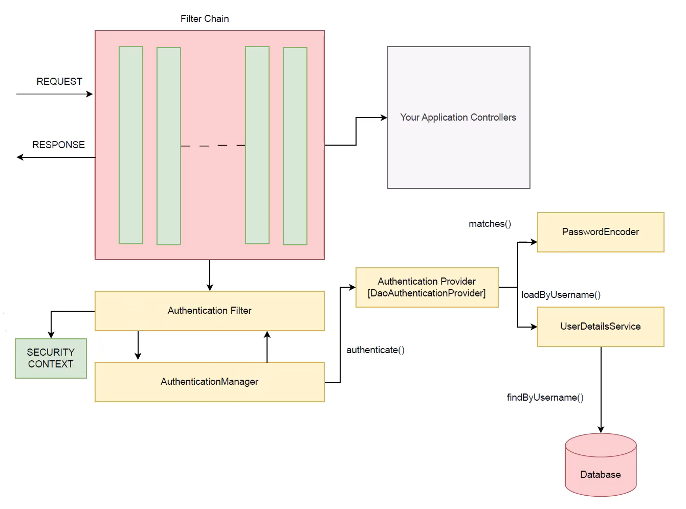
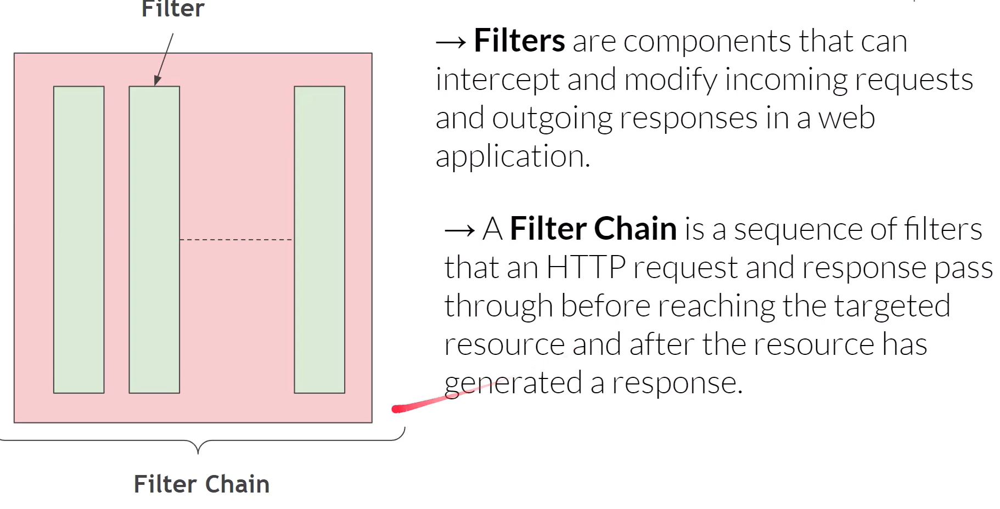
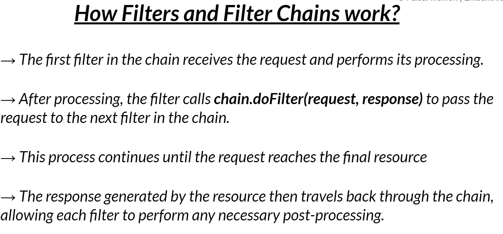
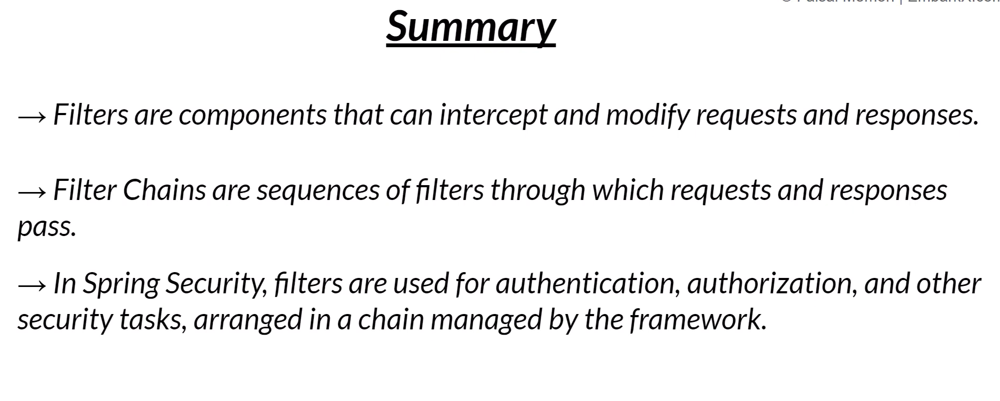

# Spring Security 

### Important of Security
- Privacy Protection
- Trust
- Integrity
- Compliance

## Role of Spring Security within the Spring EcoSystem
- Spring Framework
- Spring Boot
- Spring Data
- Spring Security
    - Authentication  - is proving who you are
    - Authorization  - is about what you're allowed to do after you've proven who you are.

| Feature       | Authentication              | Authorization               |
| ------------- | --------------------------- | --------------------------- |
| Purpose       | Verify identity             | Grant access permissions    |
| Question      | Who are you?                | What can you access?        |
| Happens when  | Before authorization        | After authentication        |
| Data involved | Credentials (password, OTP) | Roles, permissions          |
| Example       | Login                       | Access control (admin/user) |

---

# Key Security Principles
- Least Privilege  =>  Give only the minimum access required

- Secure by Design  =>  Security is built from the start, not added later

- Fail-Safe Defaults  =>  Defaults = deny access unless explicitly allowed
                      => System should be secure even when something fails

- Secure Communication  =>  Protect data in transit

- Input Validation  =>  Never trust user input (Validate & sanitize inputs)

- Auditing and Logging  =>  Track system activities

- Regular Updates and Patch Management  =>  Keep software up to date

#### Principal 
- Principal represents the currently logged-in user. Your user details (like your username or email) become your Principal. Ex: Principal: sneha_roy

#### Authentication Object
- Authentication Object is a more comprehensive representation of the user's authentication information. Ex:
- Principal: sneha_roy
- Authorities: ROLE_ADMIN

this whole is an example of Authentication Object

